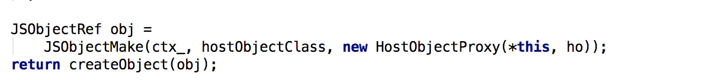

# 深入剖析 React Native 下一代架构重构

Facebook 在 2018 年 6 月官方宣布了大规模重构 React Native 的计划及重构路线图。目的是为了让 React Native 更加轻量化、更适应混合开发，接近甚至达到原生的体验。（也有可能是 React Native 团队感受到了 Google Flutter 的追赶压力，必须从架构上做出重大革新，未来才有可能和 Flutter 进行全面的竞争）。

从 Facebook 公布的官方信息来看，这是一次革命性的架构重构，主要的重构内容如下：

1.改变线程模式。UI 更新不再同时需要在三个不同的线程上触发执行，而是可以在任意线程上同步调用 JavaScript 进行优先更新，同时将低优先级工作推出主线程，以便保持对 UI 的响应。

2.引入异步渲染能力。允许多个渲染并简化异步数据处理。

3.简化 JSBridge，让它更快、更轻量。

## 目前 React Native 有哪些问题？

目前业内 React Native 框架已经有了广泛的应用。京东在这个方面起步比较早，相对来说整体解决方案也比较成熟。目前京东深度定制和扩展的 JDReact 解决方案已经累计接入了 200+个 RN 业务和 20+的独立 APP，并且承担了千万级的 DAU。从业务实际开发中还是遇到了不少坑，其中性能问题比较明显，具体有以下几类问题：

* 加载性能偏慢，因为系统或者自定义的原生 UI 组件和 API 的注册加载过程中需要验证所有属性和 JS API 的一致性，影响加载性能，甚至直接导致主 UI 线程很容易阻塞。

* JSBridge，React Native 整体生命周期和 JSBridge 绑定太紧，所有的原生和 JS 之间操作全部是通过这个 Bridge，而且每次的事件通讯是有时间间隔的，导致整体渲染过程是异步的。

* 手势问题，React Native 目前的架构，从 JS 侧很难解决很多复杂的手势问题，需要重新定制 SDK 来解决问题。

* 返回事件的处理，目前的返回事件不能像原生一样，在组件中监听。

* Layout 的计算，整体的 UI 计算必须要在 shadow layout 中完成，没有办法在整体的平台框架中计算。

现有的 Native & JS Component 组件如下，通过这些组件可以完成原生 UI 渲染和 API 调用。这些组件都是通过 packageManger 注册到系统的，当 RN 业务启动后，需要对整体的属性和方法做一些校验，存在性能损失；另外 RN 是允许多个 packagemanger 同时注册的，当 API 数量偏大时，导致的问题需要循环遍历，调用过程也存在性能损耗。

1.Native Modules ，原生端 API 接口。

2.ViewManager，原生 UI 组件。

3.Native Navigation，原生导航组件。

4.ComponentKit & Litho，原生端基于 yoga UI 组件。

5.RCTSurface，原生端 Surface 实现。

加载过程中首先需要加载初始化 React Native Core Bridge，包含以上的一些组件功能，然后才能运行业务的 JS Code，只有这步完成后，React Native 才能将 JS 的组件渲染成原生的组件：

所以目前的架构下这些组件和 API 太过依赖 JSBridge 的初始化，而且通讯能力也局限于这一条通道。从渲染的层次来看，React Native 是多线程运行的，最常见的是 JS 线程和原生端的线程，一旦线程间异常，JSBridge 整体将会阻塞，我们经常也能看到 JS 运行异常了，实际 JS 线程已经无响应了，但原生端还能响应滚动事件。

## 如何彻底解决这些问题？

针对先有框架的一些问题 Facebook 在最近的版本中尝试过很多优化工作，从 2013 年发布到目前已经更新到了 V0.58，去年一年发布了 10 多个版本。从版本更新可以看出，除了一些组件的更新和 BUG 修复外，Facebook 做了性能优化方面的尝试，让其在加载和渲染性能上尽可能的达到原生。

### 重大性能优化的版本：

* 0.33 Lazy module

* 0.40 RAM bundle/unbundle

* 0.43 FlatList/SectionList/VirtualizedList

* 0.50 SwipeableFlatList/Fiber

以下是目前官方建议的一些优化性能的方案：

1.组件的懒加载注册，原生端可以采用懒注册，在业务使用到该组件时注册。

2.按需打包，直接减少业务包大小，去掉一些不需要的 module，提高渲染速度。

3.业务的懒加载，直接减少业务渲染过程中 require 各个组件的时间。

4.UNBundle，将业务分解成小的模块，提供性能。

5.移走初始化过程中不必要的 JS module 模块。

6.提供 prepack 工具优化 JS 代码。

最新的架构又提出了 Fibe／Relay Modern 架构，整体渲染性能相比以前有了很大的提高，最新的 JDReact SDK 已经升级到这个架构，目标是将加载 JSBridge 的开销降到最低，但是文章前面提到的瓶颈问题还是没有突破。

我们和跨端平台框架 Flutter 启动和渲染做了对比，在启动性能上 React Native 稍微优于 Flutter，但渲染方面明显不如 Flutter，也就是我们说的瓶颈问题，对比如下图：

所以，我们的结论是，在现有架构下的各种优化都很难彻底解决性能问题。

## 唯有架构重构才是王道

在最近的开发者大会中，Facebook 对下一代架构重构的进展进行了介绍，我们也对 master 分支上提交的部分源码进行了分析，可以了解新架构的一些雏型设计，整体架构还在不断优化中，相信还会有更多惊喜。从现有的信息和代码来看，JS 层业务的影响较小，不会因此次大规模架构重构后需要大量适配业务代码。这次的重构主要是 JSBridge 及原生架构的重构，下面我们从几个层面对比介绍整体框架：

### 现有架构渲染原理

UI 的渲染过程分为三层：JS 业务层、shadow tree、原生 UI 层。其中 JS 和 shadow tree 是通过 JSBridge 来同步数据的，JS 层会将所有 UI node 生成一串 JSON 数据，传递到原生 shadow 层，原生 shadow 层通过传入 node 数据，新增新 UI 或者删除一些不需要的 UI 组件，这就完成了下图这三个层次之间的驱动关系：

带来的问题是整体 UI 渲染异步且太过于依赖 JSBrige，很容易出现阻塞而影响整体 UI 体验，从 JDReact 的业务开发经验来看，比如初始化过程中 UI 复杂度过高，点击 UI 时响应时间会很长，就是因为 UI 被阻塞了很难响应 touch 事件，另外 UI 大小计算 JS framework 没有办法直接计算，需要依赖原生计算完成后的回调。

再看看 SrollView 的例子，这是业务或者社区反馈性能和体验问题最大的组件。最初版本的 ScollView 是一次渲染的不作任何回收，所以启动性能慢且内存占用较大。后续版本 Flatlist 作了组件的回收，内存基本稳定了，但是快速滑动过程中出现了体验问题，容易白屏且容易卡顿。大家看下面的流程图就能明白为什么 Flatlist(基于 ScollView 实现)/ScrollView 快速滑动下会有长时间的白屏或者卡顿。

在 Flatlist 快速滑动过程中 JS 层会根据滑动的事件，触发 Flatlist item 的 render 渲染每一条数据，但是因为 JSBridge 的异步关系导致了 shadow 层最终呈现到原生的 UI 是异步的，而且滑动太快后会有大量的 UI 事件会阻塞在 JSBridge，也导致了长时间的白屏出现，同时当部分 item 滑出可视区域一定的范围后 UI 内容会被回收等待下次滑到该区域后重新渲染。

### 新架构 Fabric 渲染原理

回到之前 ScrollView 的例子，看看 Fabric 是怎么解决快速滑动过程中的性能问题的。

1.初始化：JS 到 Shadow 层已经是同步操作了，而 shadow 层到原生 UI 变成了可以异步也可以同步操作了，组件可以根据自己的业务场景来适配不同的操作。

2.滑动过程：原生端直接控制 JS 层渲染，同时创建 shadow 层的 node 节点，node 节点会采用同步的方式渲染原生 UI，整个过程中滑动的渲染是采用的同步操作，所以不会出现旧架构下白屏的问题。

### Fabric –新的 UI 架构

1.React Fabric Renderer (JS) ，JS 端的 Render 架构。

2.FabricUIManager (JS, C++) ，JS 端和原生端 UI 管理模块。

3.ComponentDescriptor (C++) ，原生端组件的唯一描述及组件属性定义。

4.Platform-specific Component Impl (ObjC++, Java) ，原生端组件。

RCTSurface (ObjC++, Java)，Surface 组件。

从这些组件的结构描述来看，新的 Fabric 架构大致如下：

1.shadow 层从原有的 Java 层，挪到了 C++层。

2.由 C++层来管理整体的 UI 组件，原有的 Java 层 UIManager 换到 C++层，管理这些 C++层到虚拟组件。

3.而原生的组件透过 JNI 层会在 C++层生成对应的实例，绑定一些属性和方法。

4.JS 层 FabricUIManager 透过 JSI，唤起 C++层去生产 node 节点，并最终对应到我们的 ComponentDescriptor。

从整体来看 JS 端的 node 节点可以完整的和 C++端的 node 节点一一对应，透过 JSI 可以完成同步的调用和属性同步，同样 C++到原生 java 层到组件是通过 JNI 来完成的，而且也是同步操作。

下面我们参考下目前 Facebook 开放出来的部分代码：

1.ComponentDescriptor，原生和原生 UI 对应的一层抽象层，这边实现了原生端组件的属性和事件，并通过唯一标示注册到 comonentRegister 中，以下是已经开放出来的 switch 组件的代码架构。

ComponentDescriptor 组件

整体的 Fabric 的 UIManger 组件和消息通道是怎么建立的呢？大家可以参考文件 Scheduler.cpp，JS 会通过 JSI 调用该接口来初始化。

1.Fabric component 注册。

2.消息通道注册。

3.初始化 UIManager 和 UIManagerbinding，其中 UIManager 提供了创建 node、clone node，添加 shadow node、关闭 surface 等功能，而 UIManagerbinding 是基于 JSI 接口直接实现了和 JS 端 UIManger 的直接调用，大家可以参考源码 JS 端是通过 JSI 的 get 方法，通过属性的方式通知 UIManagerbinding 执行 C++层的 UIManger，而 UImanger 最终会根据生成的 shadow node 生成对应的 UI。

Fabric UI 架构初始化

下面我们看看 JS 端是如何生成原生组件的，大家可以对照源码，在 JS 端我们有 FabricUIManager，在初始化 UIManagerBinding 过程中，注册到运行的 JS 环境，因为 UIManagerBinding 是 JSI 实现的，所以可以理解为我们创建了一个 Host 代理对象，注册到了 JS，而 JS 侧也对应同样的数据结构来一一对应。

下面是创建一个 node 的列子：

从目前的结构来看，后续 Fabric UI 开发，需要从 C++ component 层、shadow 层、原生 Java 层，三个层次开发，而且创建的 shadow 层也是通过 JSI 的方式和 JS 层的 node 节点一一对应的。

JS 端测量大小

### JSI 介绍

上面介绍 Fabric 架构时提到了 JSI，那到底什么是 JSI 呢？如何能做到更原子级的控制每个模块和 API 呢？他是架起 JS 和原生 java 或者 Objc 的桥梁，类似于现有架构的 JSBridge，但是采用的是内存共享、代理类的方式，JSI 所有的运行环境都是在 JSCRuntime 环境下的，为了实现和 JS 端直接通讯，我们需要在 C++层实现一个 JSI::HostObject，该数据结构只有 get、set 两个接口，通过 prop 来区分不同接口的调用。

然后通过 JSI 接口生成一个 JSObject，可以看到生成的代理对象和我们的 HostObjectProxy 是共享内存的，并且 proxy 中也实现了 set 和 get 方法。以下是具体的流程：

在 JS 端对应的是 LazyObject，通过对这些 Object 的 set、get，来完成对应 C++实现的 hostobject 方法的调用：

### TurboModule 架构

这是基于新的 JSI 架构实现的 Native module 架构。JS 层通过 JSI 获取到对应的 C++层的 module 对象的代理，最终通过 JNI 回调 Java 层 module。

C++层 NativeMoudleProxy 是通过 JSI 实现的对象，可以通过它传入 module 的名字获取 C++层注册的 module，已经这个 module 封装的所有的 API method name。所以在 JS 业务加载的时候，会将这个 proxy 生成 JS object 代理对象到 JS 层。

JS 层通过 getNativeModule API 并传递 prop 到 JSI，最终会通过 JSI 接口找到 Host object NativeModuleProxy，因 NativeModuleProxy 主要作用是将注册在 C++层的 JSI module 通过名字生成 JS Object 传递的 JS 层调用， 所以其 get 方法中只有一个属性，就是通过 JSINativeModules 获取对应的 module，而 JSINativeModules 是有缓存机制的，如果没有缓存的就直接解析该 module 中所有的 API，如果有直接读取缓存的 module 信息。

大家可以看到在解析过程中，新版本增加了同步和异步的方法，也就是 promise 和 sync。所以 JSI module 实际是可以同步操作 API 的，不像之前 JSBridge 的 API 都是异步操作的，同步操作的好处就是能做到线程间的同步。

所有的 JSI module 都是通过 JSIMoudleregistry 来注册的，当然这里注册的都是 C++层的 moulde，而所有的 C++module 最终是通过 descriptor 绑定到 java 层的 turbomoudle 中注册的 Java 层 module，也就是我们最终在原生端实现的 API，所以 C++层 module 会通过对应的 method prop 来触发 Java 层的方法调用。

而 C++层 Native module 是在 java 层 instance manger 初始化过程中注册的，遍历并注册 java 层和 C++module。

所有理解 Native Module 的调用实际就是 JSI 的调用，而运行返回结果是基础的数据类型或者 JSI object 的，所以一个 turbo module 的 method 调用，返回值是可以是 JSI object。开发者可以根据自己业务需要，将一些完整的数据结构封装成 JSI host object，这样就可以做到，JS 端同样可以获取到该对象，并同原生端对象形成了代理关系，可以同步完成一系列该 Object porp 功能操作，举个例子：

以前的调用方式通过 JSBridge 获取到一个 picture，这个数据类型对应到 JS 端只能是一些基础的数据类型，比如我们参见的图片地址 String 类型，所以如果现在要上传这个图片的话，我们将 JS 端的数据再回传到原生端，如下图：

但有了 JSI 后就不一样了，我们在 JS 端透过 JSI 获取到的是 JS Object，也就是 picture，但是这个 picture 不再是简单的数据类型，而是和原生端形成绑定关系的结构，能够支持很多属性的同步设置，如改变 alpha 值等等，会直接触发 host object 的属性和函数调用，所以我们不再需要像之前一样改变 alpha 需要很多的 JSBridge 的调用，同样上传过程可以直接操作 c++层的 Object 执行上传操作。

下面简单列举一下相关层次的调用关系：

## 社区化

React Native 目前有 52 个直接依赖包，然后这些包间接递归依赖了 589 个包，大家可以在[http://npm.anvaka.com/#/view/2d/react-native](http://npm.anvaka.com/#/view/2d/react-native)网站看看整体的依赖关系，是一个非常复杂的关系图。

从目前 React Native 开源的代码来看，整体是个很大的 repo 工程，包含了各种各样的 Native 组件、API、JS module，如何让这些组件和 API 维护更简单，让接入 React Native 架构的 APP 能将 API 或者组件快速裁剪变小也成了这次架构重构的目标。

* 删除掉一些不需要的 modules，将所有的 module 分离成小的 repo，类似于组件化模块。

* 减小业务开发的 bundle 代码的大小(按需引入和编译需要的 component)，进而提升业务的渲染和启动速度。

* 分离后将这些组件或 API 开放给社区，社区可以贡献自己的资源，这样可以让组件的维护和迭代更快，帮助减少组件维护成本。

* 减少目前 React Native SDK 开发的依赖，简化代码结构，让 SDK 升级起来更轻量、更快速。

* 增加了社区的贡献让 PR 的修复加快，让更多的开发者集中在更合理的位置，减少重复开发，降低开放的复杂度。

未来 facebook 计划：

1.删除所有觉得使用率低或者无价值的组件或者 API。

2.将现有维护的模块移到外部的 repo，单独维护。

具体组件的规划和归类，大家可以同步参考 Facebook 提供的列表，有很多组件已经明确要删掉或者移到开源社区来，比如[WebView](https://docs.google.com/spreadsheets/d/18xkWNZ7E9LgDoVfFO91_vIjWVwLOYWASsGE8Ng12nX8/edit#gid=421707506)。

以下是 React Native 组件社区的规划图：

以后原生端 Native 组件主要分三部分，一部份会放到系统的 SDK，一部分移到开源社区维护，开发者再贡献一部分组件。对开发者而言带来的影响：

1.所有组件不能像之前一样一次就同步下来了，需要根据拆分的 repo 由开发者自己按需安装 repo，碎片化比较严重。

2.因为社区运营后开发者贡献会越来越快，版本迭代也会加速，所以版本的控制和代码的安全性也是一个重要的问题。

3.很多社区化的组件是对原生 Native module 是有依赖的，所以增加了前端开发人员的集成开发难度。

## 总结

我们通过源码分析给大家简单介绍了 Facebook 的 React Native 下一代框架的设计，相信不管从性能体验和功能上都会有很大的变化。虽然整体变化很大但对于前端开发者而言 JS 的变化微乎其微，而重点改造在原生端组件和 API 架构，封装起来变得更加复杂，需要封装 C++ shadow 层，所以从以前的 JAVA 开发扩展到了 C++和 JAVA 开发，对于开发者知识结构和储备要求更高，但对于提升性能而言，这些都是值得的。

社区化运营后 Facebook 官方可以从以前的组件和框架一起开发，简化到只需关注整体框架能力和性能了，让开发者贡献维护现在组件，大大提高了框架的迭代周期。

