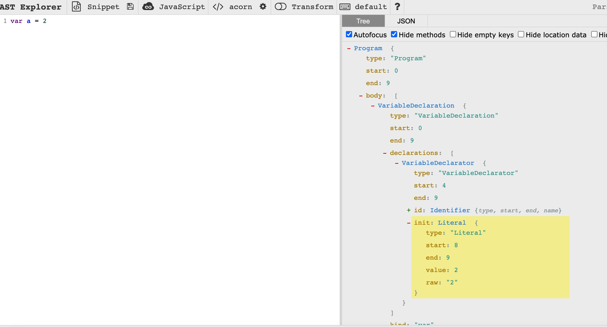

> 提问: 当在浏览器控制台输入以下代码时，为什么能把这一串字符串运行并输出的？ 
```
var a = 2
console.log(a)
```
# 运行环境
首先我们看到的是一串字符，如何将一串字符以某种规则运行，那么就需要先说一下运行环境。

JavaScript的运行不像Java语言等其他编译型语言编译后直接在操作系统上运行，因为它是脚本语言，运行时必须要借助引擎（解释器）来运行，所以它可以在封装了引擎的环境下运行。
封装了JavaScript引擎的环境可以分为两类，一类是浏览器环境；一类是非浏览器环境，比如 Node.js、MongoDB。我没有采用 wikipedia 中 clent-side 和 server-side 的直接翻译，因为JavaScript既可以编写服务端脚本也可以编写 shell 脚本，甚至图形界面应用程序。

把运行环境分为浏览器环境和非浏览器环境是因为他们提供了截然不同的操作模块。
* 浏览器环境下 JavaScript 由三部分组成，分别是 ECMAScript(描述了 JavaScript 的语法和基本对象：1:语法；2:类型；3:语句；4:关键字；5:保留字；6:操作符；7:全局对象)、DOM（文档对象模型，提供了与网页内容交互的方法和接口）和 BOM（浏览器对象模型，提供了与浏览器交互的方法和接口），BOM 和 DOM 是针对浏览器环境所扩展的操作方法。

* 非浏览器环境，比如 Node.js ，也是以 ECMAScript 为基础，扩展出了 I/O 操作、文件操作、数据库操作等等；在 MongoDB 中则是可以作为 shell 脚本操作数据库；在 Eclipse e4 中可以编写扩展。


# 运行机制
V8是Google开发的开源js引擎，在性能方面要优于其他JavaScript引擎，目前用在chrome浏览器和node.js中，用于执行js代码。V8是js虚拟机中的一种，js虚拟机就是把js编程语言翻译成机器语言。市面上比较流行的js引擎，SpiderMonkey，v8，JS core等。下文中的内容也是基于V8引擎。

JS在浏览器中被设计为单线程运行的，这是因为JS主要用来实现很多交互相关的操作，如DOM相关操作，如果是多线程会造成复杂的同步问题。而且主线程都是用来进行界面相关的渲染操作 (为什么说是主线程，因为HTML5 提供了Web Worker，独立的一个后台JS，用来处理一些耗时数据操作。因为不会修改相关DOM及页面元素，因此不影响页面性能)，如果有阻塞产生会导致浏览器卡死。

为了更好的理解JavaScript如何工作的，在后续的文章 浏览器渲染原理中 会详细介绍。
JS Engine（JS引擎）
Runtime（运行上下文）
Call Stack (调用栈)
Event Loop（事件循环）
Callback (回调)

Event Loop在之前做安卓开发的时候也有类似的知识点，它与JavaScript语言体系没关系，是一个执行模型，在不同的地方有不同的实现。浏览器和nodejs基于不同的技术实现了各自的Event Loop。
 
# 运行过程
在浏览器环境中，JavaScript引擎按标签代码块从上到下的顺序加载并立即解释执行。

JavaScript的执行是依赖JavaScript引擎，JavaScript引擎类似JVM，是一个专门处理JavaScript脚本的虚拟机，JavaScript引擎目前有很多：SpiderMonkey、JavaScriptCore、Chakra、V8等，现代JavaScript引擎都引入了Java虚拟机和C++编译器的众多技术，和早期的JavaScript引擎工作方式有很大的不同：
 早期由解释器来解释它们即可，就是将源代码转变成抽象语法树，然后在抽象语法树上解释执行，早期的JavaScriptCore就是这样工作的，后面改进了。随着将Java虚拟机的JIT技术引入，现在的做法是将抽象语法树转成中间表示（也就是字节码），然后通过JIT技术转成本地代码。也有些做法直接从抽象语法树生成本地代码的JIT技术，例如早期的V8。

目前现在的JavaScript引擎对JavaScript的处理过程和java相似，毕竟引入了java编译技术，但是还是有区别，java处理分了两个阶段：编译和解释，通过编译器将源代码解析生成字节码，后在通过JVM将字节码转成机器码后运行。JavaScript引擎编译把编译和解释这两个阶段结合起来了，都在JavaScript引擎中执行。

在JavaScript引擎的解释过程中，解释器会对源代码进行词法分析、语法分析，并生法分析，生成抽象语法树（AST），不过它会再基于抽象语法树生成字节码，最后再根据字节码来执行程序、输出结果。


从源代码到语法树 —— 解析器从源码中生成一棵 [抽象语法树](https://en.wikipedia.org/wiki/Abstract_syntax_tree)。

从语法树到字节码 —— V8 的解释器 [Ignition](https://v8.dev/docs/ignition) 从语法树中生成字节码，解析执行字节码，同时也收集TurboFan优化编译所需要的信息（在 2017 年之前 并没有该步骤，具体可以看 [这篇文章](https://blog.sessionstack.com/how-javascript-works-inside-the-v8-engine-5-tips-on-how-to-write-optimized-code-ac089e62b12e)）。

从字节码到机器码 —— V8 的编译器 [TurboFan](https://v8.dev/docs/turbofan) 从字节码中生成图，利用Ignitio所收集的类型信息，用高度优化的机器码替代部分字节码。

## 生成 AST
V8引擎首先是通过编译器（parse）将源代码解析抽象语法树（AST），生成AST分为两个阶段，一是词法分析，二是语法分析：


* 词法分析：将源代码拆成最小的、不可再分的词法单元（token）。例如上面程序var a = 2;。这段程序通常会被分解成这些词法单元：var、a、=、2、;。五个词法单元。空格是否会被当作词法单元，取决于空格在这门语言是否具有意义，在JavaScript中，空格是不会被当作词法单元。[在线工具](https://resources.jointjs.com/demos/javascript-ast)




* 语法分析：这个过程是将词法单元流（数组）转换成一个由元素逐级嵌套所组成的代表了程序语法结构的树，这个树被称为抽象语法树（AST）, 如果源码符合语法规则，这一步就会顺利完成。但如果源码存在语法错误，这一步就会终止，并抛出一个“语法错误”, 我们通常在运行过程中报的错就是在这一步抛出来的。var a = 2;的抽象语法树中可能会有一个叫做VariableDeclaration的顶级节点，接下来是一个叫作Identifier（它的值是a）的子节点，以及一个叫做AssignmentExpression的子节点。AssignmentExpression节点有一个叫做NumericLiteral（它的值是2）的子节点。[在线工具](https://astexplorer.net/)

这一部分内容会在webpack和bebal阶段再着重讲解，bebal将ES6语法转成ES5语法，就是通过解析、转译、生成三个部分，将ES6源码解析成AST，再将ES6语法的AST转成ES5的AST，最后利用它来生成ES5源代码，这就是Babel的基本实现原理。

## 创建执行上下文
## 生成字节码
## 执行代码
### 执行上下文的执行阶段
