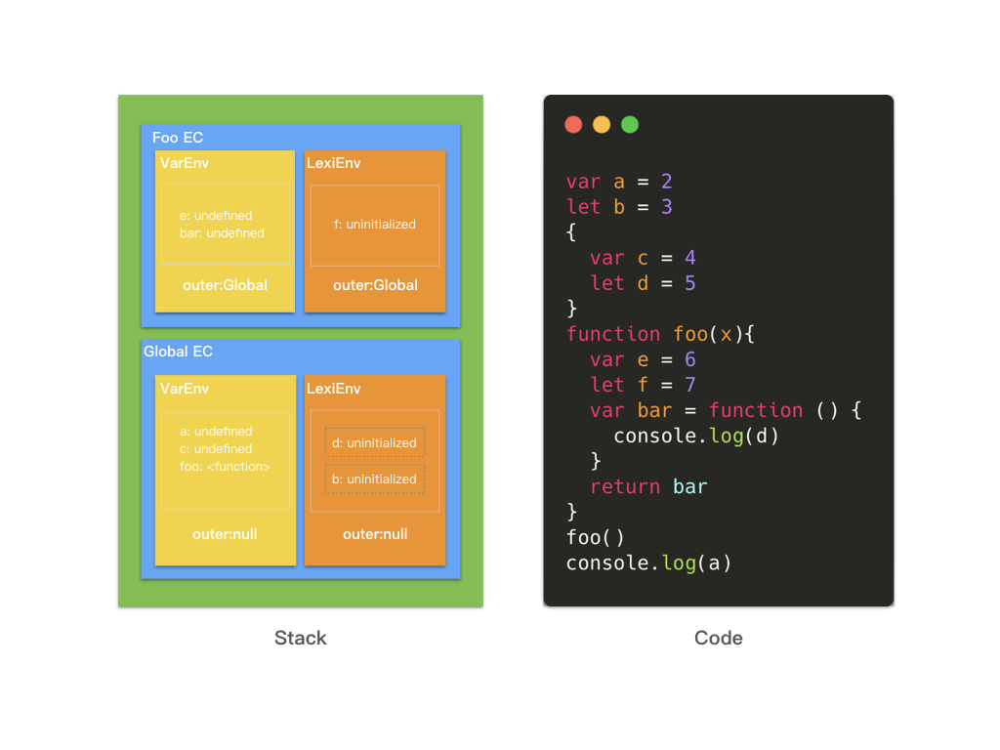

> 提问: 当在浏览器控制台输入以下代码时，为什么能把这一串字符串运行并输出的？ 

```
var a = 2
let b = 3
{
  var c = 4
  let d = 5
}
function foo(x){
  var e = 6
  let f = 7
  var bar = function () {
    console.log(d)
  }
  return bar
}
foo()
console.log(a)
```

# 运行环境
首先我们看到的是一串字符，如何将一串字符以某种规则运行，那么就需要先说一下运行环境。

将我们的这串代码直接交给浏览器或者Node执行时,底层的CPU是不认识的，也没法执行,CPU只认识自己的指令集，指令集对应的是汇编代码，写汇编语言也是非常痛苦的一件事，而且不同类型的CPU的指令集是不一样的，那就意味着得给每一种CPU重写汇编代码。

JavaScript的运行不像Java语言等其他编译型语言编译后直接在操作系统上运行，因为它是脚本语言，运行时必须要借助引擎（解释器）来运行，所以它可以在封装了引擎的环境下运行。

JavaScirpt引擎将JS代码编译为不同CPU(Intel, ARM以及MIPS等)对应的汇编代码，这样我们才不要去翻阅每个CPU的指令集手册。当然，JavaScript引擎的工作也不只是编译代码，它还要负责执行代码、分配内存以及垃圾回收。

封装了JavaScript引擎的环境可以分为两类，一类是浏览器环境；一类是非浏览器环境，比如 Node.js、MongoDB。我没有采用 wikipedia 中 clent-side 和 server-side 的直接翻译，因为JavaScript既可以编写服务端脚本也可以编写 shell 脚本，甚至图形界面应用程序。

把运行环境分为``浏览器环境``和``非浏览器环境``是因为他们提供了截然不同的操作模块。
* 浏览器环境下 JavaScript 由三部分组成，分别是 ECMAScript(描述了 JavaScript 的语法和基本对象：1:语法；2:类型；3:语句；4:关键字；5:保留字；6:操作符；7:全局对象)、DOM（文档对象模型，提供了与网页内容交互的方法和接口）和 BOM（浏览器对象模型，提供了与浏览器交互的方法和接口），BOM 和 DOM 是针对浏览器环境所扩展的操作方法。

* 非浏览器环境，比如 Node.js ，也是以 ECMAScript 为基础，扩展出了 I/O 操作、文件操作、数据库操作等等；在 MongoDB 中则是可以作为 shell 脚本操作数据库；在 Eclipse e4 中可以编写扩展。


# 运行机制
V8是Google开发的开源js引擎，在性能方面要优于其他JavaScript引擎，目前用在chrome浏览器和node.js中，用于执行js代码。V8是js虚拟机中的一种，js虚拟机就是把js编程语言翻译成机器语言。市面上比较流行的js引擎，SpiderMonkey，v8，JS core等。下文中的内容也是基于V8引擎。

JS在浏览器中被设计为单线程运行的，这是因为JS主要用来实现很多交互相关的操作，如DOM相关操作，如果是多线程会造成复杂的同步问题。而且主线程都是用来进行界面相关的渲染操作 (为什么说是主线程，因为HTML5 提供了Web Worker，独立的一个后台JS，用来处理一些耗时数据操作。因为不会修改相关DOM及页面元素，因此不影响页面性能)，如果有阻塞产生会导致浏览器卡死。

为了更好的理解JavaScript如何工作的，在后续的文章 浏览器渲染原理中 会详细介绍。
JS Engine（JS引擎）
Runtime（运行上下文）
Call Stack (调用栈)
Event Loop（事件循环）
Callback (回调)

Event Loop在之前做安卓开发的时候也有类似的知识点，它与JavaScript语言体系没关系，是一个``执行模型``，在不同的地方有不同的实现。浏览器和nodejs基于不同的技术实现了各自的Event Loop。
 
# 运行过程
在浏览器环境中，JavaScript引擎我们可以简单理解为按标签代码块从上到下的顺序加载并立即解释执行。

JavaScript的执行是依赖JavaScript引擎，JavaScript引擎类似JVM，是一个专门处理JavaScript脚本的虚拟机，JavaScript引擎目前有很多：SpiderMonkey、JavaScriptCore、Chakra、V8等，现代JavaScript引擎都引入了Java虚拟机和C++编译器的众多技术，和早期的JavaScript引擎工作方式有很大的不同：
 早期由解释器来解释它们即可，就是将源代码转变成抽象语法树，然后在抽象语法树上解释执行，早期的JavaScriptCore就是这样工作的，后面改进了。随着将Java虚拟机的JIT技术引入，现在的做法是将抽象语法树转成中间表示（也就是字节码），然后通过JIT技术转成本地代码。也有些做法直接从抽象语法树生成本地代码的JIT技术，例如早期的V8。

目前现在的JavaScript引擎对JavaScript的处理过程和java相似，毕竟引入了java编译技术，但是还是有区别，java处理分了两个阶段：编译和解释，通过编译器将源代码解析生成字节码，后在通过JVM将字节码转成机器码后运行。JavaScript引擎编译把编译和解释这两个阶段结合起来了，都在JavaScript引擎中执行。

在JavaScript引擎的解释过程中，解释器会对源代码进行词法分析、语法分析，并生法分析，生成``抽象语法树（AST）``，不过它会再基于抽象语法树生成字节码，最后再根据字节码来执行程序、输出结果。


简单地说，``Parser``将JS源码转换为AST，然后``Ignition``将AST转换为Bytecode，最后``TurboFan``将Bytecode转换为经过优化的Machine Code(实际上是汇编代码)。

* 如果函数没有被调用，则V8不会去编译它。
* 如果函数只被调用1次，则Ignition将其编译Bytecode就直接解释执行了。TurboFan不会进行优化编译，因为它需要Ignition收集函数执行时的类型信息。这就要求函数至少需要执行1次，TurboFan才有可能进行优化编译。
* 如果函数被调用多次，则它有可能会被识别为热点函数，且Ignition收集的类型信息证明可以进行优化编译的话，这时TurboFan则会将Bytecode编译为Optimized Machine Code，以提高代码的执行性能。

从源代码到语法树 —— 解析器从源码中生成一棵 [抽象语法树](https://en.wikipedia.org/wiki/Abstract_syntax_tree)。

从语法树到字节码 —— V8 的解释器 [Ignition](https://v8.dev/docs/ignition) 从语法树中生成字节码，解析执行字节码，同时也收集TurboFan优化编译所需要的信息（在 2017 年之前 并没有该步骤，具体可以看 [这篇文章](https://blog.sessionstack.com/how-javascript-works-inside-the-v8-engine-5-tips-on-how-to-write-optimized-code-ac089e62b12e)）。

从字节码到机器码 —— V8 的编译器 [TurboFan](https://v8.dev/docs/turbofan) 从字节码中生成图，利用Ignitio所收集的类型信息，用高度优化的机器码替代部分字节码。

## 生成 AST
知道了大概的运行过程，我们来细分的看一下每个阶段的执行过程。
V8引擎首先是通过编译器（parse）将源代码解析抽象语法树（AST），生成AST分为两个阶段，一是词法分析，二是语法分析：


* **词法分析**：将源代码拆成最小的、不可再分的词法单元（token）。例如上面程序var a = 2;。这段程序通常会被分解成这些词法单元：var、a、=、2、;。五个词法单元。空格是否会被当作词法单元，取决于空格在这门语言是否具有意义，在JavaScript中，空格是不会被当作词法单元。[在线工具](https://resources.jointjs.com/demos/javascript-ast)


* **语法分析**：这个过程是将上面所生成的词法单元流（数组）转换成一个由元素逐级嵌套所组成的代表了程序语法结构的树，这个树被称为抽象语法树（AST）, 如果源码符合语法规则，这一步就会顺利完成。但如果源码存在语法错误，这一步就会终止，并抛出一个“语法错误”, 我们通常在运行过程中语法错误的问题就是在这一步抛出来的。var a = 2;的抽象语法树中可能会有一个叫做VariableDeclaration的顶级节点，接下来是一个叫作Identifier（它的值是a）的子节点，以及一个叫做AssignmentExpression的子节点。AssignmentExpression节点有一个叫做NumericLiteral（它的值是2）的子节点。[在线工具](https://astexplorer.net/)

这一部分内容会在webpack和bebal阶段再着重讲解，bebal将ES6语法转成ES5语法，就是通过解析、转译、生成三个部分，将ES6源码解析成AST，再将ES6语法的AST转成ES5的AST，最后利用它来生成ES5源代码，这就是Babel的基本实现原理。

## 执行上下文的创建阶段
有了 AST 后，接下来 V8 就会生成该段代码的执行上下文，执行上下文可以理解为代码的运行环境。

**执行上下文的类型**

JavaScript 中有三种执行上下文类型。

* ``全局执行上下文`` — 这是默认或者说基础的上下文，任何不在函数内部的代码都在全局上下文中。它会执行两件事：创建一个全局的 window 对象（浏览器的情况下），并且设置 this 的值等于这个全局对象。一个程序中只会有一个全局执行上下文。
* ``函数执行上下文`` — 每当一个函数被调用时, 都会为该函数创建一个新的上下文。每个函数都有它自己的执行上下文，不过是在函数被调用时创建的。函数上下文可以有任意多个。每当一个新的执行上下文被创建，它会按定义的顺序（将在后文讨论）执行一系列步骤。
* ``Eval 函数执行上下文`` — 执行在 eval 函数内部的代码也会有它属于自己的执行上下文，但由于 JavaScript 开发者并不经常使用 eval，所以在这里我不会讨论它。

每当要执行我们编写的函数或脚本时，JavaScript解释器都会创建一个新的上下文。每个脚本/代码都以一个称为全局执行上下文的执行上下文开头。每次我们调用一个函数时，都会创建一个新的执行上下文并将其放在执行堆栈的顶部。当您调用嵌套函数并调用另一个嵌套函数时，遵循相同的模式。


 
 让我们看看执行我们的代码时发生了什么
 * 创建全局执行上下文并放置在执行堆栈的底部。
 * 当bar被调用时，一个新的bar执行上下文被创建并被放在全局执行环境的顶部。
 * 当bar调用嵌套函数foo时，将创建一个新的foo执行上下文，并将其放在bar执行上下文的顶部。
 * 当foo返回时，其上下文将从堆栈中弹出，并且流程返回到bar上下文。
 * 执行完成后，流程将返回到全局上下文，最后将堆栈清空。

 > 执行堆栈以LIFO（后进先出）数据结构方式工作。它等待最顶层的执行上下文返回，然后再执行下面的上下文。
 

我们以前常说的``VO,AO,作用域链``等概念，是在**ES3**时期规范里面的模型，不能够描述新的特性，但很多的博客和书籍还是原来的概念，这里需要我们注意一下，从**ES5**开始，``词法环境``在理论上更适合并且更抽象地替代了以前的ES3概念。

从概念上讲，执行上下文的结构如下所示：

```
// ES5中的执行上下文
ExecutionContext = { 
  ThisBinding：<this value>，
  VariableEnvironment：{...}，
  LexicalEnvironment：{...} 
}
```

这里有个误区，国内译文关于ES5之后的执行上下文的组成都是以上面的结构，但上面这个是ES5中对于执行上下文的描述，在ES6之后，执行上下文中的``ThisBinding``放在了环境记录器中，原因是由于es6之后对于箭头函数的this，也是静态(词法)地进行绑定，而非函数被执行时绑定。所以ES6之后执行上下文的结构如下:

```
// ES6中的执行上下文
ExecutionContext = { 
  VariableEnvironment：{...}，
  LexicalEnvironment：{...} 
}
```

[ES5中的执行上下文](https://262.ecma-international.org/5.1/#sec-10.3)

[ES6中的词法环境](https://262.ecma-international.org/6.0/#sec-lexical-environments)

在执行上下文创建阶段会创建下面两个组件：

* ``变量环境(VariableEnvironment)``用于变量、参数(arguments)和函数声明的初始存储。声明的var变量使用undefined值初始化。
* ``词法环境(LexicalEnvironment)``只是现阶段变量环境的副本。在ES6中，还用来存储函数声明和变量(let和const)的绑定，而变量环境只能用来存储var变量绑定
 
两者都是执行上下文的（相同类型）组件，都是Lexical Environments, 但是它们具有不同的作用:

创建执行上下文时，其LexicalEnvironment和VariableEnvironment组件最初具有相同的值。VariableEnvironment组件的值永远不会更改，而LexicalEnvironment组件的值可能会在执行上下文中的代码执行期间更改。通常是在catch字句和With Statements中会发生

**什么是Lexical Environments？**
> Lexical Environments是一种``规范类型``，基于 ECMAScript 代码的词法嵌套结构来定义标识符和具体变量和函数的关联。一个词法环境由环境记录器和一个可能的引用外部词法环境的空值组成。

而执行上下文中的VariableEnvironment和LexicalEnvironment都是这种规范类型的抽象体现，这里把Lexical Environments用英文标识出来也是由于国内很多译文把这个与执行上下文中的LexicalEnvironment都翻译为词法环境，但他们实际表示的概念是不同的。

简单来说Lexical Environments是一种持有标识符—变量映射的结构。（这里的标识符指的是变量/函数的名字，而变量是对实际对象[包含函数类型对象]或原始数据的引用）。

在Lexical Environments的内部有两个组件：

(1) **环境记录器**(EnvironmentRecord) : 存储变量和函数声明的实际位置，记录了相关联的Lexical Environments中的标识符的绑定。

(2) **一个外部环境的引用**: 外部环境的引用意味着它可以访问其父级Lexical Environments（作用域）, 在全局环境中没有外部环境引用的Lexical Environments, 引用值为null，在函数环境中，函数定义阶段就已经静态(词法)的确认了该外部环境的引用，这也就是我们常说的JS的静态作用域。

环境记录器主要有两种： **声明性环境记录**和**对象环境记录**。声明性环境记录用于定义ECMAScript语言语法元素（例如FunctionDeclarations，VariableDeclarations和Catch子句）的结果，这些元素直接将标识符绑定与ECMAScript语言值相关联。对象环境记录用于定义ECMAScript元素（例如WithStatement）的结果，这些元素将标识符绑定与某些对象的属性相关联。

在``ECMA``规范中，环境记录器的抽象方法如下:

| 方法 | 备注 |
| --- | --- |
| HasBinding（N）  | 确定环境记录是否具有字符串值N的绑定。返回true|false |
| CreateMutableBinding（N，D） | 在环境记录中创建一个新的但未初始化的可变绑定。字符串值N是绑定名称的文本。如果可选的布尔参数D为true，则可以随后删除该绑定。 |
| CreateImmutableBinding（N，S） | 在环境记录中创建一个新的但未初始化的不可变绑定。字符串值N是绑定名称的文本。如果S为true，则无论在引用该绑定的操作的严格模式设置如何的情况下，尝试在初始化绑定之前访问绑定的值或在绑定初始化之后对其进行设置都会始终引发异常。S是一个可选参数，默认为false。 |
| InitializeBinding（N，V） | 设置环境记录中已经存在但未初始化的绑定的值。字符串值N是绑定名称的文本。V是绑定的值，并且是任何ECMAScript语言类型的值。|
| SetMutableBinding（N，V，S） | 设置环境记录中已经存在的可变绑定的值。字符串值N是绑定名称的文本。V是绑定的值，并且可以是任何ECMAScript语言类型的值。S是一个布尔标志。如果S为true并且无法设置绑定，则抛出TypeError异常。 |
| GetBindingValue（N，S） | 返回环境记录中已经存在的绑定的值。字符串值N是绑定名称的文本。S用于标识源自严格模式代码的引用，或者以其他方式需要严格模式引用语义的引用。如果S为true并且绑定不存在，则引发ReferenceError异常。如果绑定存在但未初始化，则无论S的值如何，都会引发ReferenceError 。|
| DeleteBinding（N） | 从环境记录中删除绑定。字符串值N是绑定名称的文本。如果存在N的绑定，请删除该绑定并返回true。如果绑定存在但无法删除，则返回false。如果绑定不存在，则返回true。 |
| HasThisBinding（） | 确定环境记录是否建立this绑定。如果是，则返回true；否则，则返回false。 |
| HasSuperBinding（） | 确定环境记录是否建立super方法绑定。如果是，则返回true；否则，则返回false |
| WithBaseObject（） | 如果此环境记录与一条with语句相关联，则返回with对象。否则，返回undefined |

其中声明式环境记录器有两个抽象子类： ``函数(function)环境记录器``和``模块(module)环境记录器``:

函数环境记录用于表示函数的顶级作用域，并且如果函数不是ArrowFunction，则提供this绑定。如果一个函数不是ArrowFunction函数并引用super，则其函数Environment Record还包含用于super从函数内部执行方法调用的状态。

除了包含所有声明式环境记录器的方法外，还有下列字段:

| 字段 | 值 | 备注 |
| --- | --- | --- |
| [[thisValue]] | Any | 这是此函数调用使用的this值。 |
| [[thisBindingStatus]] | "lexical"/ "initialized"/"uninitialized" | 如果值为"lexical"，则这是ArrowFunction，并且没有本地this值。|
|[[FunctionObject]] |	Object|	 调用导致创建此环境记录的函数对象。|
|[[HomeObject]]|	Object/undefined | 如果关联的函数具有super属性访问权限，并且不是ArrowFunction，则[[HomeObject]]是该函数作为方法绑定到的对象。[[HomeObject]]的默认值是undefined。|
|[[NewTarget]]| Object/undefined | 如果此环境记录是通过[[Construct]]内部方法创建的，则[[NewTarget]]是[[Construct]] newTarget参数的值。否则，其值为undefined。|


**对于环境记录器，ECMA制定了各种实现方法，对此就不一一介绍了，感兴趣的可以去ECMA官方文档查看，这里只是便于理解列举出来一些。**
		
基于以上对于执行上下文的了解，我们可以得到在创建阶段题目执行上下文环境的伪代码: 



我们可以看到，在创建阶段对于变量的定义和函数的声明，执行上下文都已经做了标识符的绑定，这也是我们常说的``变量声明提升``和``函数声明提升``。在函数的执行上下文中，外部环境的引用指向global的Lexical Environments, 从而使函数内部在查找变量时通过先找当前环境，再查找outer...这样的一个结构形成了我们的``作用域链``，并且可以看出是在函数定义的时候就已经静态的确定了函数的作用域。对于var定义的变量，在初始化的时候会赋值为undefind, 而对于let和const定义的变量，会在初始化的时候设置为uninitialized的状态，当我们在定义之前去访问var和let定义的变量时，他们会有不同的表现:

```
console.log(a) // undefined
console.log(b) // Uncaught ReferenceError: b is not defined
var a = 2
let b = 3
```

当我们在变量赋值前去访问该变量，对于a变量，在执行上下文创建阶段变量环境中初始化为undefined，所以我们可以打印出undefined, 而对于b变量，词法环境中初始化为uninitialized, 当我们在赋值前去访问的时候，系统就会报```Uncaught ReferenceError: b is not defined```这样的一个错误信息，这也是我们常说的let的``暂时性死区``。

到此我们执行上下文的就已经创建完成。

## 生成字节码
## 执行代码(执行上下文的执行阶段)